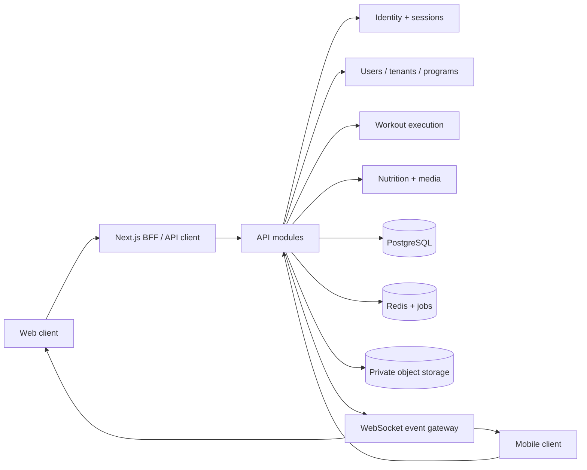

# Elevate Training Platform (superseded)

This draft is superseded by [`elevate-os-production-specification.md`](./elevate-os-production-specification.md) and the Next.js implementation in `web/`.

---

# Elevate Training Platform
## Technical Specification and Implementation Roadmap

**Document status:** Superseded — kept for history only  
**Audience:** Product, design, engineering, QA, security, and operations teams  
**Product promise:** A trainer-led fitness experience that feels as considered as a premium consumer product, while remaining fast and legible in the middle of a workout.

> Design reference: the restraint, hierarchy, motion, and precision of [Apple India](https://www.apple.com/in/). This is a quality bar, not a visual copy target. Elevate must retain its own fitness identity, content, and interaction model.

---

## 1. Product Definition

Elevate is a multi-tenant personal-training platform with three isolated roles:

| Role | Primary job | Data boundary |
|---|---|---|
| Admin | Manage trainers, platform health, moderation, and audit activity | Platform-wide operational data; no unnecessary client health detail |
| Trainer | Build programs, assign plans, review adherence, and coach clients | Own gym/tenant and assigned clients only |
| Client | Execute workouts, record nutrition, and follow progress | Own profile and trainer-approved content only |

### Success criteria

- A client can start a scheduled workout in at most three taps from the home screen.
- Active workout controls respond within 100 ms locally and remain usable through intermittent connectivity.
- Trainer changes to a plan appear to an online client within 2 seconds, with a visible revision marker.
- Every authenticated request is tenant-scoped and role-authorized server-side.
- Key workflows meet WCAG 2.2 AA, including keyboard operation, screen-reader labels, reduced motion, and sufficient contrast.
- The product feels premium through typography, spacing, content quality, transitions, and states rather than decoration alone.

### Product assumptions and guardrails

- One client has one primary trainer at a time; a future coach team can be added through memberships.
- A trainer may belong to one or more gyms/tenants.
- Supplement prompts are configurable reminders, not medical advice. A client can dismiss or disable any prompt; product copy must direct users to a qualified clinician for contraindications.
- Weight, images, nutrition, and health-adjacent information are sensitive personal data. Retention, export, and deletion are first-class requirements.
- Video demonstrations are uploaded or licensed by the business. Do not use unlicensed third-party media in production.

---

## 2. Recommended Architecture

### Stack

- **Web:** Next.js + TypeScript, App Router, server-rendered authenticated shell, responsive CSS, and a small motion layer using CSS/Web Animations.
- **Mobile:** React Native with Expo for iOS and Android; share TypeScript domain models, API client, validation, and design tokens with web.
- **API:** TypeScript NestJS modular monolith, REST/JSON for commands and queries, WebSocket gateway for live events. A modular monolith keeps authorization and transactions coherent before service extraction is justified.
- **Database:** PostgreSQL 16 with UUID primary keys, `tenant_id` on tenant-owned tables, row-level security as defense in depth, and migrations via Prisma or Drizzle.
- **Cache and jobs:** Redis for short-lived cache, presence, rate limits, and BullMQ-compatible jobs for reminders, image processing, and notification fanout.
- **Object storage:** S3-compatible private buckets for food photos, progress images, and videos; signed URLs with short expiry; CDN for approved demonstration media.
- **Realtime:** WebSockets with Redis pub/sub adapter. Persist important events before publishing them; realtime is an acceleration layer, not the source of truth.
- **Observability:** OpenTelemetry traces, structured logs, error tracking, product analytics with health data excluded or redacted.
- **Infrastructure:** Managed PostgreSQL, Redis, object storage, and containerized API deployed across availability zones. Web and API support blue/green or rolling deploys.

### Logical boundaries



### Module ownership

1. Identity and access: login, refresh, MFA, sessions, role and tenant authorization.
2. Tenant administration: gyms, trainers, memberships, invitations, suspension.
3. Client profile: baseline metrics, goals, measurements, progress media, consent.
4. Program builder: templates, exercises, sets, reps, time, progression, HIIT blocks, versioning.
5. Workout runtime: daily session state, timers, checklist, exercise completion, offline queue.
6. Nutrition: meal entries, photo processing, portions, trainer review, feedback.
7. Notifications: reminders, plan updates, completion events, delivery preferences.
8. Operations: audit log, activity metrics, feature flags, incident controls.

---

## 3. Security, Privacy, and Access Control

### Authentication

- Separate role-branded entry points: `/login/admin`, `/login/trainer`, `/login/client`. They use one identity service but distinct allowed-role checks.
- Email/password with Argon2id hashing; optional passkeys and TOTP MFA for admins and trainers; email verification for clients.
- Short-lived access token in memory and rotating refresh token in an HttpOnly, Secure, SameSite cookie for web. Mobile uses OS secure storage.
- Session revocation, device list, login history, password reset, breached-password checks, and IP/device rate limiting.
- Do not trust a role supplied by the client. Resolve user, memberships, active tenant, and permissions server-side on every request.

### Authorization model

```text
request -> authenticate token -> resolve user + tenant -> check role/policy -> query with tenant predicate -> redact response -> audit mutation
```

- Admin policies operate on platform entities and must explicitly opt into sensitive detail.
- Trainer policies require an active `trainer_client` relationship for client records.
- Client policies permit own records, assigned program revisions, and trainer-approved content only.
- Every repository method receives an authorization context; direct unscoped queries are prohibited by lint/review convention.
- PostgreSQL RLS repeats tenant and role constraints for defense in depth.

### Privacy controls

- Encrypt in transit and at rest; use KMS-managed keys for storage and database backups.
- Private media by default; signed URLs expire in 5 minutes. Strip EXIF location metadata on upload.
- Audit profile changes, program assignment/revision, media access, exports, deletions, and admin impersonation.
- Provide data export, account deletion workflow, consent history, retention policy, and notification opt-out.
- Malware scan and MIME sniff every upload; allowlist image/video types; enforce size and dimension limits.
- Never put weight, food photos, or health details in push-notification text or analytics event names.

---

## 4. Database Schema

All tables use `id uuid`, `created_at timestamptz`, `updated_at timestamptz`, and soft deletion only where stated. Foreign keys use `ON DELETE RESTRICT` for auditability unless noted.

### Identity and tenant tables

| Table | Important columns | Constraints / indexes |
|---|---|---|
| `users` | `email`, `phone`, `password_hash`, `status`, `last_login_at` | Unique normalized email; no role column as source of truth |
| `user_roles` | `user_id`, `role` (`admin`, `trainer`, `client`) | Unique pair; a user may have multiple roles, while each login entry point restricts one |
| `tenants` | `name`, `slug`, `status`, `timezone`, `branding_json` | Unique slug |
| `tenant_memberships` | `tenant_id`, `user_id`, `membership_role`, `status`, `joined_at` | Unique tenant/user; index `(tenant_id, membership_role, status)` |
| `sessions` | `user_id`, `refresh_token_hash`, `device_name`, `expires_at`, `revoked_at` | Index active sessions by user |
| `mfa_methods` | `user_id`, `type`, `secret_ciphertext`, `verified_at` | Encrypt secret; unique active method per type |
| `audit_events` | `tenant_id`, `actor_user_id`, `action`, `entity_type`, `entity_id`, `metadata_json`, `ip_hash` | Append-only; index tenant/time and actor/time |

### Client profile tables

| Table | Important columns | Constraints / indexes |
|---|---|---|
| `client_profiles` | `user_id`, `tenant_id`, `birth_date`, `height_cm`, `start_weight_kg`, `current_weight_kg`, `goal`, `onboarding_completed_at` | Goal enum: `fat_loss`, `muscle_gain`, `shredding`; unique user/tenant |
| `body_measurements` | `client_id`, `measured_at`, `weight_kg`, `height_cm`, `body_fat_pct`, `waist_cm`, `notes` | BMI calculated on read or materialized after validated height/weight; index client/date |
| `progress_media` | `client_id`, `storage_key`, `captured_at`, `category`, `visibility`, `moderation_status`, `width`, `height` | Category `before`, `progress`, `after`; private by default |
| `trainer_client` | `tenant_id`, `trainer_id`, `client_id`, `status`, `started_at`, `ended_at` | Partial unique active relationship; indexes both directions |
| `consents` | `user_id`, `kind`, `version`, `accepted_at`, `revoked_at` | Immutable acceptance history |

BMI is derived as `weight_kg / (height_m ^ 2)` and returned with a `calculation_basis` timestamp. It is not presented as a diagnosis.

### Program and exercise tables

| Table | Important columns | Constraints / indexes |
|---|---|---|
| `exercises` | `name`, `muscle_groups`, `equipment`, `instruction_markdown`, `demo_media_id`, `status` | Curated system catalog plus tenant custom exercises |
| `programs` | `tenant_id`, `created_by`, `name`, `goal`, `workout_type`, `status` | Types `cardio`, `weights`, `hiit`; unique active slug per tenant |
| `program_revisions` | `program_id`, `version`, `published_at`, `snapshot_json`, `change_summary` | Immutable after publish; unique program/version |
| `program_days` | `revision_id`, `day_number`, `label`, `estimated_minutes` | Unique revision/day |
| `workout_blocks` | `program_day_id`, `sort_order`, `block_type`, `title`, `duration_seconds`, `config_json` | Block types `warmup`, `checklist`, `exercise`, `interval`, `recovery` |
| `block_exercises` | `block_id`, `exercise_id`, `sort_order`, `sets`, `reps`, `weight_strategy`, `rest_seconds`, `duration_seconds`, `notes` | Validate config by block type |
| `program_assignments` | `revision_id`, `trainer_id`, `client_id`, `starts_on`, `ends_on`, `status` | Index client/date; preserve prior revisions |

`config_json` is validated against versioned JSON Schema. Examples: cardio machine rotations, weight progression strategy, and HIIT work/rest intervals.

### Execution and nutrition tables

| Table | Important columns | Constraints / indexes |
|---|---|---|
| `workout_sessions` | `assignment_id`, `client_id`, `scheduled_for`, `started_at`, `completed_at`, `status`, `active_block_id`, `device_id` | Unique client/assignment/date; statuses `planned`, `in_progress`, `paused`, `completed`, `abandoned` |
| `block_completions` | `session_id`, `block_id`, `started_at`, `completed_at`, `actual_json`, `client_note` | Unique session/block |
| `checklist_items` | `tenant_id`, `label`, `item_type`, `default_offset_minutes`, `active` | `item_type` includes hydration and supplement reminder; no medical claims |
| `session_checklist` | `session_id`, `checklist_item_id`, `due_at`, `completed_at`, `skipped_reason` | Unique session/item |
| `meal_logs` | `client_id`, `eaten_at`, `meal_type`, `quantity_text`, `calories_estimate`, `trainer_status`, `trainer_note` | Index client/eaten date; estimates clearly labeled |
| `meal_media` | `meal_log_id`, `storage_key`, `processing_status`, `moderation_status` | Private signed access |
| `notifications` | `user_id`, `type`, `payload_json`, `scheduled_at`, `delivered_at`, `read_at` | Idempotency key; index user/unread |
| `device_tokens` | `user_id`, `platform`, `token_ciphertext`, `last_seen_at` | Unique token |

---

## 5. API Contract

Base URL: `/api/v1`. JSON uses ISO-8601 UTC timestamps, UUIDs, cursor pagination, and RFC 7807-style errors. Mutations accept an `Idempotency-Key` where retries are possible.

### Authentication and account

| Method | Endpoint | Purpose | Roles |
|---|---|---|---|
| `POST` | `/auth/login` | Authenticate with `entryPoint` (`admin`, `trainer`, `client`) and credentials | Public |
| `POST` | `/auth/refresh` | Rotate refresh token | Authenticated session |
| `POST` | `/auth/logout` | Revoke current session | All |
| `POST` | `/auth/mfa/verify` | Complete MFA challenge | Admin/trainer |
| `GET` | `/me` | Return user, active tenant, capabilities, and preferences | All |
| `GET` | `/me/sessions` | List devices/sessions | All |
| `DELETE` | `/me/sessions/{sessionId}` | Revoke a device session | All |

### Admin

| Method | Endpoint | Purpose |
|---|---|---|
| `GET` | `/admin/overview` | Platform health, active tenants, trainer/client counts, usage trends |
| `GET` | `/admin/trainers?status=&cursor=` | Search and filter trainers |
| `POST` | `/admin/trainers/invitations` | Invite trainer to a tenant |
| `PATCH` | `/admin/trainers/{trainerId}` | Suspend, reactivate, or update trainer access |
| `GET` | `/admin/audit-events?actor=&action=&from=&to=` | Search audit trail |
| `GET` | `/admin/usage` | Aggregated sessions, retention, notification delivery, error rates |

Admin responses omit client health detail unless a documented operational need and permission allow it.

### Trainer

| Method | Endpoint | Purpose |
|---|---|---|
| `GET` | `/trainer/clients?status=&goal=&cursor=` | Client roster with summary metrics |
| `GET` | `/trainer/clients/{clientId}/summary` | Profile, adherence, measurements, recent meals, media permissions |
| `GET` | `/trainer/clients/{clientId}/activity?from=&to=` | Workout and checklist timeline |
| `GET` | `/trainer/clients/{clientId}/meals?status=&cursor=` | Food logs for review |
| `POST` | `/trainer/programs` | Create draft cardio, weights, or HIIT program |
| `PATCH` | `/trainer/programs/{programId}` | Edit draft metadata/content |
| `POST` | `/trainer/programs/{programId}/publish` | Create immutable revision and publish |
| `POST` | `/trainer/assignments` | Assign published revision to one or more clients |
| `POST` | `/trainer/assignments/{id}/push-update` | Notify client of newly published revision |
| `PATCH` | `/trainer/meals/{mealId}/review` | Add guidance and mark reviewed |
| `POST` | `/trainer/exercises` | Add a tenant exercise and demonstration media |

### Client

| Method | Endpoint | Purpose |
|---|---|---|
| `POST` | `/client/onboarding` | Save baseline metrics, goal, consent, and profile completion |
| `GET` | `/client/dashboard` | Today card, progress summary, reminders, unread updates |
| `PATCH` | `/client/profile` | Update current metrics and preferences |
| `POST` | `/client/progress-media/presign` | Request secure upload URL |
| `POST` | `/client/progress-media/complete` | Confirm processed image and metadata |
| `GET` | `/client/workouts/today` | Resolve assigned workout and revision |
| `POST` | `/client/workout-sessions` | Start or resume a session |
| `PATCH` | `/client/workout-sessions/{id}` | Pause, complete block, log actuals, or complete session |
| `POST` | `/client/workout-sessions/{id}/checklist/{itemId}` | Complete or skip checklist item |
| `POST` | `/client/meals` | Create meal log and optional media upload reference |
| `GET` | `/client/meals?from=&to=&cursor=` | View own food history |
| `GET` | `/client/progress` | Measurements, BMI trend, sessions, media gallery |
| `GET` | `/client/notifications` | Read notification center |
| `POST` | `/client/notifications/{id}/read` | Mark notification read |

### Realtime event contract

WebSocket endpoint: `/api/v1/realtime` authenticated with the same session. Subscribe only to server-approved channels.

```json
{
  "type": "workout.session.updated",
  "eventId": "evt_01J...",
  "occurredAt": "2026-09-14T09:30:00Z",
  "tenantId": "tenant_uuid",
  "entityId": "session_uuid",
  "version": 4,
  "payload": {
    "status": "in_progress",
    "activeBlockId": "block_uuid",
    "completedBlocks": 2
  }
}
```

Events: `program.assignment.updated`, `workout.session.updated`, `checklist.reminder.due`, `meal.reviewed`, `notification.created`, and `presence.changed`. Clients deduplicate by `eventId`, apply only increasing `version`, and refetch after reconnect.

---

## 6. Role User Flows

### Admin flow

1. Open `/login/admin` and authenticate with MFA.
2. Land on operations overview: system health, active trainers, client activity, notification failures.
3. Invite a trainer, select tenant, and review invitation status.
4. Open a trainer profile to inspect account status, assigned client count, and audit history.
5. Suspend/reactivate access with reason; all mutations create audit events.
6. Monitor usage and export operational reports without exposing unnecessary health data.

### Trainer flow

1. Open `/login/trainer`, authenticate, and select an active gym if needed.
2. Dashboard opens to client roster sorted by attention needed: missed session, unread meal log, stale measurement, or plan update.
3. Open a client summary: current weight, BMI trend, start delta, completion rate, recent food logs, and before/after gallery subject to consent.
4. Create a draft program from a template or from scratch.
5. Configure cardio, weight progression, or HIIT blocks; attach licensed demonstrations; preview mobile runtime.
6. Publish immutable revision, assign to client, and push update. Client sees a revision badge and can be notified in real time.
7. Review completed sessions and meal photos, leave guidance, and revise the next plan.

### Client flow

1. Open `/login/client`, verify account, and complete onboarding.
2. Enter start weight, height, date of birth/age, goal, consent, and optional baseline image.
3. Home shows today’s workout, next reminder, progress snapshot, and trainer updates.
4. Start warm-up, complete timer, finish checklist, choose the available workout, and execute blocks.
5. View demonstration, start/ pause timer, record actual reps/weight/time, and complete each block.
6. See recovery recommendation and guided stretch after completion.
7. Log food photo, quantity, and portion details; receive trainer review later.
8. Update metrics and add progress photos over time.

---

## 7. Key Wireframes

Wireframes use a 12-column desktop grid and a single-column mobile runtime. The runtime hides secondary navigation once a session starts.

### Role login pages

```text
DESKTOP 1440px
+---------------------------------------------------------------+
| ELEVATE mark                              Help  Status        |
|                                                               |
|  [role-specific image/video panel] |  Welcome back          |
|  quiet motion, real training image |  Admin / Trainer / Client
|                                    |  Email                 |
|                                    |  Password              |
|                                    |  [Continue securely]   |
|                                    |  Forgot password       |
|                                    |  MFA challenge appears |
+---------------------------------------------------------------+

MOBILE 390px
+-------------------------+
| ELEVATE                 |
| [compact visual crop]   |
| Client sign in          |
| Email                   |
| Password                |
| [Continue securely]     |
| Forgot password         |
+-------------------------+
```

Role-specific copy, allowed-role validation, and distinct accent treatment identify the entry point. The form remains the same accessible component. Never reveal whether an email exists.

### Client onboarding and profile

```text
+--------------------------------------------------+
| Step 2 of 4                 Save and exit        |
| Your starting point                              |
| Weight [ 72.0 kg ]   Height [ 178 cm ]          |
| Age [ 29 ]             BMI 22.7  (calculated)   |
| Goal                                              |
| [ Fat loss ] [ Muscle gain ] [ Shredding ]       |
|                                                  |
| Baseline photo (optional)   [Upload image]       |
| [Back]                              [Continue]   |
+--------------------------------------------------+
```

On later visits, the profile becomes an editable timeline: current metric card, start delta, BMI trend, completed sessions, food-log tab, and progress gallery with dates and visibility controls.

### Client daily workout runtime

```text
+-------------------------------------------+
| 09:12       Today's session       2 / 6   |
| Warm-up                                    |
| Cross trainer                              |
|                                           |
|              18:42                         |
|          [Pause] [Finish]                  |
|                                           |
|  Next: pre-workout checklist              |
|  Hydration  •  Creatine due in 18 min     |
|                                           |
| [Demo video / form cues]                   |
+-------------------------------------------+
```

Flow states: `warmup -> checklist -> selection -> active blocks -> recovery -> complete`. The active timer is local and monotonic; server checkpoints allow resume. Large hit targets, high contrast, lock-screen-safe notifications, and one primary action reduce workout friction.

### Trainer dashboard

```text
+--------------------------------------------------------------------------------+
| ELEVATE | Clients | Programs | Reviews |                         Search  Avatar |
+--------------------------------------------------------------------------------+
| Good morning, Maya                  [Create program] [Invite client]            |
| [24 clients] [86% completion] [7 need attention] [3 meal logs]                  |
+--------------------------+-----------------------------------------------------+
| Filters                  | Client                  Last session   Status        |
| Goal                     | Aisha K.                Today 08:20    On track       |
| Program                  | Daniel R.               3 days ago     Needs review   |
| Attention               | Priya S.                Yesterday      New meal log   |
|                          |                                                     |
|                          | [Open client]                                      |
+--------------------------+-----------------------------------------------------+
```

Client detail uses a stable summary header, metric trend, adherence timeline, meal review queue, media gallery, and program revision history. Desktop density is balanced by generous row height and clear hierarchy; mobile converts the table into stacked actionable rows.

### Admin panel

```text
+-----------------------------------------------------------------------+
| ELEVATE OPS | Overview | Trainers | Tenants | Audit | Usage            |
+-----------------------------------------------------------------------+
| Platform health: Operational       [Last 24h]                         |
| [API p95] [WebSocket connected] [Media processing] [Notification rate] |
+---------------------+-------------------------------------------------+
| Trainer status      | Recent activity                                |
| Active 42           | Trainer invited                               |
| Pending 5           | Plan revision published                       |
| Suspended 2         | Login risk challenged                         |
|                     | [View audit trail]                            |
+---------------------+-------------------------------------------------+
```

Admin navigation and destructive actions are visually distinct, require confirmation with reason, and are fully audited.

---

## 8. Workout Runtime and Demonstration Examples

### Shared exercise demonstration contract

Every exercise record must have: name, objective, equipment, difficulty, setup, execution cues, breathing cue, common errors, stop conditions, media asset, captions/transcript, and trainer notes. The runtime pairs a short looped preview with text cues so the workout remains usable when video is unavailable.

```json
{
  "exerciseId": "ex_treadmill_01",
  "title": "Treadmill incline walk",
  "goalTags": ["fat_loss", "conditioning"],
  "durationSeconds": 900,
  "demo": {
    "posterUrl": "signed-url",
    "videoUrl": "signed-url",
    "captionsUrl": "signed-url",
    "fallbackCues": ["Tall posture", "Light grip", "Steady nasal breathing"]
  },
  "logging": { "fields": ["speed", "incline", "perceived_exertion"] }
}
```

### Cardio demo: 3-set rotation

- **Set duration:** 20 minutes: 15-minute machine block plus 2-minute ski-machine block and transition allowance defined by the trainer. The product must surface exact configured durations rather than silently claiming a one-hour total when the source intervals do not add up.
- **Machine sequence:** cross trainer 15:00, treadmill 15:00, air bike 15:00, spin bike 15:00, ski machine 02:00. Because the listed intervals exceed one hour, the builder displays a validation warning and requires the trainer to choose either a one-hour cap or the full 62-minute sequence before publishing.
- **Runtime:** each machine is a timed block with demonstration, intensity cue, pause, skip reason, and actual effort log.

```json
{
  "type": "cardio",
  "sets": 3,
  "blocks": [
    { "exercise": "cross_trainer", "durationSeconds": 900 },
    { "exercise": "treadmill", "durationSeconds": 900 },
    { "exercise": "air_bike", "durationSeconds": 900 },
    { "exercise": "spin_bike", "durationSeconds": 900 },
    { "exercise": "ski_machine", "durationSeconds": 120 }
  ],
  "validation": { "requiresTrainerAcknowledgement": true }
}
```

### Weight-lifting demo: goal-aware progression

- Trainer selects single or dual muscle focus, chooses exercises, and sets progression strategy.
- Example: `3 sets x 8/10/12`, weight strategy `heavy_to_light`, 90-second rest, with goal-sensitive coaching copy.
- Client logs completed reps, weight, RPE, pain/stop flag, and optional note. Never force completion through pain reporting.

```json
{
  "type": "weights",
  "focus": "dual_muscle",
  "muscles": ["back", "biceps"],
  "goal": "muscle_gain",
  "blocks": [
    { "exercise": "lat_pulldown", "sets": 3, "reps": [8, 10, 12], "weightStrategy": "heavy_to_light", "restSeconds": 90 },
    { "exercise": "incline_curl", "sets": 3, "reps": [10, 10, 12], "weightStrategy": "trainer_defined", "restSeconds": 60 }
  ]
}
```

### HIIT demo: trainer-authored interval plan

- Trainer composes work/rest blocks, rounds, exercise order, scale options, and demonstration media.
- Client runtime includes a visual interval clock, audio/vibration cues, round progress, pause/resume, and safe fallback when the screen locks.

```json
{
  "type": "hiit",
  "rounds": 4,
  "blocks": [
    { "exercise": "battle_rope", "workSeconds": 30, "restSeconds": 30, "scale": "lower_amplitude" },
    { "exercise": "step_up", "workSeconds": 40, "restSeconds": 20, "scale": "bodyweight_only" }
  ],
  "cooldownSeconds": 300
}
```

### Post-workout recovery

The completion screen recommends trainer-configured low-intensity cardio and a guided stretch sequence. Each stretch has duration, side, cue, demo, and skip controls. Completion records recovery separately from the main session.

---

## 9. Notifications, Offline Use, and Resilience

- Reminder scheduler computes local time from tenant/client timezone and stores idempotent notification jobs.
- Checklist examples: hydration reminder, L-carnitine, pre-workout, and creatine 30 minutes before workout. Copy is neutral: “Reminder set by your trainer,” with dismiss/edit controls and a supplement-safety disclaimer in settings.
- WebSocket updates are optimistic only for UI freshness. All writes go through idempotent REST commands.
- During a workout, cache the published revision and current session in encrypted local storage. Queue block completions and logs while offline; reconcile by event version after reconnect.
- Conflict rule: server-owned program revision wins; client-owned actual logs merge by block id and timestamp. Surface a recovery banner if reconciliation needs attention.
- Push, email, and in-app notification preferences are independent. Quiet hours apply to non-critical notifications.

---

## 10. UX and Design System Requirements

### Visual direction

- Editorial, quiet, high-contrast palette: warm white, ink, graphite, electric lime or signal coral as a restrained action accent. Avoid generic purple gradients and dashboard clutter.
- Expressive display type for headings paired with a highly legible sans-serif for controls and workout data. Typography is loaded locally or through a licensed provider with a system fallback.
- 8px maximum card radius, strong alignment, generous whitespace, and high-quality photography/video with meaningful captions.
- Use motion for page entrance, progress transitions, timer state, and confirmation. Honor `prefers-reduced-motion` and avoid motion that delays task completion.
- Use icons from the chosen icon library inside controls; every unfamiliar icon has a tooltip and accessible label.

### Component states

Every component must define loading, empty, success, error, offline, disabled, focus-visible, and permission-denied states. The client runtime additionally defines paused, reconnecting, trainer-updated, skipped, and completed states.

### Responsive behavior

- Mobile-first workout runtime at 390px width; test 320px, 390px, 430px, tablet, and desktop.
- No horizontal scroll in primary flows. Timer, primary action, current exercise, and safety controls remain within the first viewport.
- Desktop trainer/admin surfaces support dense scanning with keyboard navigation; mobile surfaces prioritize one decision per screen.

---

## 11. Quality and Acceptance Strategy

### Automated tests

- Unit: BMI calculation, workout duration validation, progression rules, reminder offsets, permissions, and event deduplication.
- API integration: role/tenant matrix for every endpoint, RLS tests, idempotency, upload signing, and revision immutability.
- Component: login states, onboarding validation, timer controls, checklist, media upload, and dashboard filters.
- End-to-end: three login roles, client onboarding, warm-up through recovery, trainer publish/push, meal review, admin suspension, and reconnect/resume.
- Load: 10,000 concurrent connected clients with 1,000 simultaneous active timers; measure event fanout, p95 API latency, and reconnect storms.
- Security: dependency scanning, SAST, DAST, upload abuse, session fixation, broken access control, rate limiting, and audit integrity.

### Definition of done for the runtime MVP

- A client can complete cardio, weights, and HIIT sessions with persisted progress online and offline.
- A trainer can publish a revision and see client completion state update within two seconds when connected.
- A client can upload a meal photo and portion details; the trainer can review it without cross-tenant access.
- All role login pages reject credentials for the wrong entry point without account enumeration.
- Lighthouse performance budgets: mobile LCP <= 2.5s on dashboard, initial JS <= 180 KB compressed for the unauthenticated shell, and no layout shift in the runtime.

---

## 12. Phased Implementation Roadmap

### Phase 0: Product, risk, and foundations (1-2 weeks)

- Confirm goal taxonomy, cardio duration discrepancy, supplement copy, consent, retention, and media licensing.
- Finalize architecture decision record, threat model, design tokens, accessibility baseline, analytics redaction policy, and environments.
- Deliver clickable role login, onboarding, runtime, trainer, and admin prototypes with mobile states.

**Exit:** approved flows, schema draft, API contract, content inventory, and performance/security budgets.

### Phase 1: Identity, tenancy, and premium shell (2-3 weeks)

- Implement users, roles, tenants, memberships, sessions, MFA, invitations, audit events, and role-specific login.
- Build shared responsive shell, tokens, typography, navigation, notification center, and error/loading states.
- Add CI, migrations, seed data, feature flags, observability, and basic RLS tests.

**Exit:** each role can sign in, see only its shell, and pass authorization matrix tests.

### Phase 2: Client profile and onboarding (2 weeks)

- Implement onboarding metrics, goal selection, BMI derivation, editable measurements, consent, signed media uploads, gallery, and progress summary.
- Add image processing, EXIF removal, moderation status, export/delete requests.

**Exit:** client profile is usable on mobile and trainer can view only assigned client data.

### Phase 3: Workout engine and offline runtime (4-5 weeks)

- Build exercise catalog, program drafts, immutable revisions, assignments, warm-up timer, checklist, workout selection, block runtime, actual logging, recovery, and session persistence.
- Add cardio duration validation, weights progression configuration, and HIIT interval builder.
- Add demonstration media player with captions and fallback cues.
- Add encrypted local cache, offline queue, reconciliation, and reconnect tests.

**Exit:** all three workout demos are executable end to end with persisted sessions and accessible controls.

### Phase 4: Realtime coaching and notifications (2-3 weeks)

- Add WebSocket gateway, event versioning, presence, assignment updates, trainer push, reminder scheduling, push/in-app notifications, quiet hours, and delivery telemetry.
- Instrument p95 latency and reconnect behavior.

**Exit:** trainer updates reach an online client within 2 seconds and do not corrupt active sessions.

### Phase 5: Nutrition and trainer operations (3 weeks)

- Add meal photo upload, portions, review queue, trainer notes, client history, filters, and progress analytics.
- Complete trainer dashboard: roster, attention queue, program builder, client detail, and revision history.

**Exit:** a trainer can manage a representative cohort without spreadsheet workarounds.

### Phase 6: Admin, hardening, and launch (3-4 weeks)

- Complete admin overview, trainer lifecycle, usage metrics, audit search, support controls, feature flags, and incident tooling.
- Run accessibility audit, penetration test, load test, backup restore drill, app-store readiness, and moderated client usability sessions.
- Roll out by feature flag to one trainer cohort, then expand using measured activation, completion, crash, latency, and notification metrics.

**Exit:** launch checklist signed by product, security, design, QA, and operations.

### Post-launch evolution

- Coach teams and delegated permissions.
- Wearable integrations only after core logging is reliable.
- Advanced progression recommendations with explicit trainer approval.
- Localization, regional units, and region-specific privacy/consent policy.

---

## 13. Initial Delivery Backlog

1. Create repository packages: `web`, `mobile`, `api`, `shared`, and `infra`.
2. Add migrations for identity, tenant membership, client profile, program revision, session, meal, media, notification, and audit tables.
3. Implement authorization context and tenant-scoped repository primitives before feature endpoints.
4. Build the three login routes and shared credential/MFA flow.
5. Ship client onboarding and profile summary with seeded demo content.
6. Implement workout runtime state machine and focused timer tests.
7. Implement trainer program builder with cardio duration warning and HIIT interval editor.
8. Add realtime assignment/session events and reconnect behavior.
9. Add media upload pipeline and nutrition review workflow.
10. Add admin operations surface, audit search, and launch observability.

This ordering makes the real-time workout experience and premium interaction quality visible early, while keeping identity, privacy, and tenant isolation underneath every feature rather than retrofitting them later.
